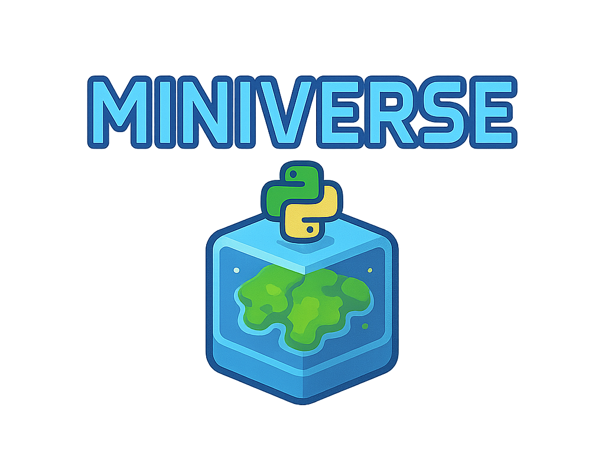

<p align="center"></p>

<p align="center"><em>Build generative agent simulations.</em></p>

<p align="center">
  <a href="https://github.com/miniverse-ai/miniverse"></a>
  <a href="https://github.com/miniverse-ai/miniverse"></a>
  <a href="https://github.com/miniverse-ai/miniverse"></a>
  <a href="https://x.com/local0ptimist"></a>
</p>

---

Miniverse is a Python-first simulation library inspired by Stanford's [Generative Agents](https://arxiv.org/pdf/2304.03442) study. The goal is to give developers everything needed to build simulations with comparable fidelity: hard deterministic physics, partial observability, structured memories, and optional LLM cognition. It focuses on agent logic and state management rather than rendering.

You write the physics (`SimulationRules`), decide how much cognition stays deterministic versus LLM-driven, and the orchestrator composes those modules so you can run reproducible baselines or improvised experiments.

**Alpha:** APIs are still moving. Every breaking change is logged in `CHANGELOG.md` with context.

## Setup

```bash
# clone the repository
git clone https://github.com/miniverse-ai/miniverse.git
cd miniverse

# install dependencies into a local uv environment
uv sync
```

Run examples with `uv run ...`. A PyPI package is not published yet.

## Tour the examples

Each example folder ships a README with prompts, flags, and debugging tips.

### Workshop progression (`examples/workshop/`)

1. `01_hello_world` - Single deterministic agent, minimal `SimulationRules`. Run: `uv run python -m examples.workshop.01_hello_world.run`
2. `02_deterministic` - Multiple agents with threshold logic and resource coupling.
3. `03_llm_single` - Swaps in `LLMExecutor`; requires `LLM_PROVIDER`, `LLM_MODEL`, and a provider API key.
4. `04_team_chat` - Natural-language coordination via the `communication` field; memories capture transcripts.
5. `05_stochastic` - Adds randomness to physics while LLM cognition adapts.
6. `monte_carlo.py` - Batch runner executing many trials with different seeds, printing statistics (mean backlog, clearance rate, worst case).

`examples/workshop/run.py` ties these ideas together: deterministic baseline by default, `--llm` flag, cadence controls, optional world-engine calls, and per-tick analysis hooks.

### Snake (`examples/snake/run.py`)

- Tier-2 grid world with deterministic movement and ASCII perception windows.
- Demonstrates how `customize_perception()` can inject readable summaries while keeping structured data intact.

Run: `uv run python -m examples.snake.run --ticks 40`

### Smallville Valentine's micro-replication (`examples/smallville/`)

- Recreates the Generative Agents Valentine's scenario with planning, execution, reflection, and memory streams.
- Debug flags (`DEBUG_LLM`, `DEBUG_MEMORY`, `MINIVERSE_VERBOSE`) surface prompts, memories, and world updates.

Run:

```bash
export LLM_PROVIDER=openai
export LLM_MODEL=gpt-5-nano
export OPENAI_API_KEY=sk-your-key
uv run python examples/smallville/valentines_party.py
```

The folder includes a notebook and notes detailing the replication.

### Use local LLMs with Ollama

Prefer to run everything on your machine? Any Ollama model can drive Miniverse as long as it returns JSON that matches the schemas.

1. [Install Ollama](https://ollama.com/download) and start the daemon (`ollama serve` launches automatically on macOS/Windows; Linux users can run `ollama serve` manually).
2. Pull a model (e.g., the latest Llama 3.1 8B):
   ```bash
   ollama pull llama3.1
   ```
3. Point Miniverse at the local server:
   ```bash
   export LLM_PROVIDER=ollama
   export LLM_MODEL=llama3.1   # or any tag shown by `ollama list`
   export OLLAMA_BASE_URL=http://127.0.0.1:11434  # optional; this is the default
   uv run python examples/workshop/run.py --llm
   ```

No API keys are required in this mode, and the same retry/validation logic is used to keep responses schema-safe. See `docs/USAGE.md#local-llms-ollama` for detailed guidance (GPU/CPU requirements, troubleshooting, and multi-model tips).

## How a tick works

1. `SimulationRules.apply_tick()` updates deterministic physics (resource drains, stochastic events).
2. `build_agent_perception()` enforces partial observability (own status, shared dashboards, broadcasts, direct messages, optional grid window).
3. Executors (deterministic or `LLMExecutor`) return an `AgentAction` per agent.
4. `SimulationRules.process_actions()` can resolve the world; otherwise the world-engine LLM processes the actions.
5. Persistence stores the new `WorldState` and actions (`InMemoryPersistence`, `JsonPersistence`, or `PostgresPersistence`).
6. `MemoryStrategy` records observations so agents have context on the next tick.

Hooks such as `customize_perception()`, `should_stop()`, cadence utilities, and tick listeners let you adjust behavior without editing the orchestrator.

## Minimal harness

```python
from pathlib import Path
from miniverse import Orchestrator, SimulationRules, ScenarioLoader, build_default_cognition
from miniverse.schemas import AgentAction, WorldState

loader = ScenarioLoader(scenarios_dir=Path("examples/scenarios"))
world_state, profiles = loader.load("workshop_baseline")
agents = {profile.agent_id: profile for profile in profiles}

class WorkshopRules(SimulationRules):
    def apply_tick(self, state: WorldState, tick: int) -> WorldState:
        updated = state.model_copy(deep=True)
        backlog = updated.resources.get_metric("task_backlog", default=6, label="Task Backlog")
        backlog.value = max(0, int(backlog.value) - 1)
        return updated

    def validate_action(self, action: AgentAction, state: WorldState) -> bool:
        return True

world_prompt = "You are the world engine. Apply validated actions deterministically."
agent_prompts = {
    agent_id: f"You are {profile.name}, a {profile.role}. Return an AgentAction JSON."
    for agent_id, profile in agents.items()
}

cognition = {agent_id: build_default_cognition() for agent_id in agents}

orchestrator = Orchestrator(
    world_state=world_state,
    agents=agents,
    world_prompt=world_prompt,
    agent_prompts=agent_prompts,
    simulation_rules=WorkshopRules(),
    agent_cognition=cognition,
)

result = await orchestrator.run(num_ticks=10)
```

Swap agents to `LLMExecutor`, add planners (`LLMPlanner` or deterministic alternatives), and wire reflection engines when you need higher-fidelity cognition.

## Library map

- **Orchestrator (`miniverse/orchestrator.py`)** - tick loop, prompt preflight, persistence/memory integration, cadence handling.
- **Simulation rules (`miniverse/simulation_rules.py`)** - deterministic physics, validation, optional deterministic `process_actions()`, lifecycle hooks.
- **Perception (`miniverse/perception.py`)** - Stanford-style partial observability with grid visibility and ASCII helpers.
- **Cognition (`miniverse/cognition/`)** - planners, executors, reflection engines, prompt rendering, cadence utilities, scratchpads.
- **Memory (`miniverse/memory.py`)** - FIFO default; extend for weighted or semantic retrieval.
- **Persistence (`miniverse/persistence.py`)** - async backends for state, actions, memories.
- **Environment helpers (`miniverse/environment/`)** - graph occupancy, BFS pathfinding, grid move validation, visibility rendering.
- **LLM utilities (`miniverse/llm_calls.py`, `miniverse/llm_utils.py`)** - structured calls with schema validation and retry feedback.
- **Scenario loader (`miniverse/scenario.py`)** - JSON-to-world-state converter.

## Debugging and analysis

- `DEBUG_LLM=1` prints prompts and responses.
- `DEBUG_MEMORY=1` logs memory writes and retrievals.
- Tick listeners (`tick_listeners` argument on `Orchestrator`) let you stream metrics or run custom analysis.
- The Monte Carlo script shows how to batch runs with different seeds and summarize outcomes.

## Documentation

- `docs/USAGE.md` - scenario authoring, cognition wiring, cadence decisions.
- `docs/PROMPTS.md` - renderer placeholders, action catalog formatting, template conventions.
- `docs/architecture/` - deep dives on cognition flow, environment tiers, persistence design.
- `docs/RESEARCH.md` - research notes referencing Stanford Generative Agents, Smallville-inspired studies, branching narrative systems, structured simulation-state management, and other sources catalogued in `docs/research/`.
- `ISSUES.md` - active investigations and roadmap items.

## Contributing

- Run `uv run pytest` before opening a PR.
- Keep changes scoped; include transcripts or logs when demonstrating new agent behavior.
- We welcome new scenarios, physics modules, cognition strategies, and tooling improvements.

## Credits

- Creator: [Kenneth / @local0ptimist](https://x.com/local0ptimist)
- Co-conspirators: GPT-5 Codex, Claude Code, and everyone building stranger simulations than we predicted.
- Research inspirations: detailed commentary lives in [`docs/RESEARCH.md`](docs/RESEARCH.md) and `docs/research/`.

## License

MIT. Fork responsibly.
